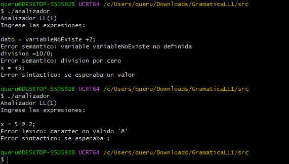
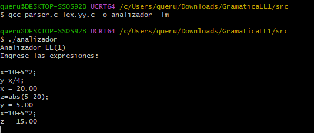

# Gramatica LL(1)

Este proyecto implementa una gramatica LL(1) capaz de procesar expresiones matematicas, asignacion de variables y funciones como sin, cos, tan y abs.

El proyecto incluye:

- Analisis lexico
- Analisis sintactico
- Analisis semantico
- Conjuntos PRIMEROS
- Conjuntos SIGUIENTES
- Conjuntos de PREDICCION
- Pruebas de implementacion

## Hecho por

- Johan Galeano

## Funcionalidades

La gramatica permite trabajar con los operadores:

```text
+
-
*
/
%
```

Tambien permite las funciones:

```text
sin
cos
tan
abs
```

Se pueden realizar asignaciones de variables como:

```text
x = 10;
```

Tambien se pueden utilizar expresiones:

```text
resultado = 10 + 5 * 2;
```

Y funciones matematicas:

```text
angulo = sin(30);
valor = abs(5 - 20);
```

## Estructura del proyecto

```text
GramaticaLL1/
│
├── docs/
│   ├── gramatica.md
│   ├── primeros.md
│   ├── siguientes.md
│   └── prediccion.md
│
├── src/
│   ├── parser.c
│   ├── scanner.l
│   └── tokens.h
│
├── evidencias/
│   ├── pruebas_validas.png
│   └── pruebas_errores.png
│
└── README.md
```

## Gramatica utilizada

```text
inicio -> linea inicio
        | epsilon

linea -> ID = expr ;

expr -> elemento sumaResta

sumaResta -> + elemento sumaResta
           | - elemento sumaResta
           | epsilon

elemento -> valor multDiv

multDiv -> * valor multDiv
         | / valor multDiv
         | % valor multDiv
         | epsilon

valor -> NUM
       | ID
       | ( expr )
       | operacion ( expr )

operacion -> sin
           | cos
           | tan
           | abs
```

## Analisis lexico

El analisis lexico se encuentra en:

```text
src/scanner.l
```

Este archivo fue desarrollado con Flex y reconoce:

- Numeros
- Identificadores
- Operadores
- Parentesis
- Asignaciones
- Funciones matematicas

Los tokens utilizados son:

```text
NUM
ID
SIN
COS
TAN
ABS
MAS
MENOS
MULT
DIV
MOD
IGUAL
PUNTOCOMA
PAR_IZQ
PAR_DER
```

Tambien detecta caracteres que no pertenecen al lenguaje.

Por ejemplo:

```text
x = 5 @ 2;
```

El simbolo `@` no pertenece al lenguaje y es detectado como un error lexico.

## Analisis sintactico

El analisis sintactico se encuentra en:

```text
src/parser.c
```

El parser fue implementado manualmente como un parser predictivo LL(1).

Cada funcion representa un no terminal de la gramatica:

```text
inicio
linea
expr
sumaResta
elemento
multDiv
valor
operacion
```

El parser toma decisiones observando un solo token de entrada.

Por ejemplo, para la regla:

```text
valor -> NUM
       | ID
       | ( expr )
       | operacion ( expr )
```

se puede elegir la produccion correspondiente dependiendo del token actual.

Esto permite implementar el comportamiento de una gramatica LL(1).

## Analisis semantico

La parte semantica permite:

- Guardar variables
- Consultar variables
- Actualizar variables
- Realizar operaciones matematicas
- Detectar variables no definidas
- Detectar division por cero
- Detectar modulo por cero

Ejemplo:

```text
x = 10;
y = x + 5;
```

Resultado:

```text
x = 10.00
y = 15.00
```

Si se utiliza una variable que no existe:

```text
dato = variableNoExiste + 2;
```

se genera:

```text
Error semantico: variable variableNoExiste no definida
```

Si se intenta dividir por cero:

```text
division = 10 / 0;
```

se genera:

```text
Error semantico: division por cero
```

## PRIMEROS

Los conjuntos PRIMEROS se encuentran explicados en:

```text
docs/primeros.md
```

Resumen:

```text
PRIMERO(inicio)     = { ID, epsilon }

PRIMERO(linea)      = { ID }

PRIMERO(expr)       = { NUM, ID, (, sin, cos, tan, abs }

PRIMERO(sumaResta)  = { +, -, epsilon }

PRIMERO(elemento)   = { NUM, ID, (, sin, cos, tan, abs }

PRIMERO(multDiv)    = { *, /, %, epsilon }

PRIMERO(valor)      = { NUM, ID, (, sin, cos, tan, abs }

PRIMERO(operacion)  = { sin, cos, tan, abs }
```

## SIGUIENTES

Los conjuntos SIGUIENTES se encuentran explicados en:

```text
docs/siguientes.md
```

Resumen:

```text
SIGUIENTE(inicio)      = { $ }

SIGUIENTE(linea)       = { ID, $ }

SIGUIENTE(expr)        = { ;, ) }

SIGUIENTE(sumaResta)   = { ;, ) }

SIGUIENTE(elemento)    = { +, -, ;, ) }

SIGUIENTE(multDiv)     = { +, -, ;, ) }

SIGUIENTE(valor)       = { *, /, %, +, -, ;, ) }

SIGUIENTE(operacion)   = { ( }
```

## PREDICCION

Los conjuntos de PREDICCION se encuentran en:

```text
docs/prediccion.md
```

Estos conjuntos permiten saber que produccion utilizar observando un solo token de entrada.

Por ejemplo:

```text
valor -> NUM
{ NUM }

valor -> ID
{ ID }

valor -> ( expr )
{ ( }

valor -> operacion ( expr )
{ sin, cos, tan, abs }
```

Como los conjuntos de prediccion de las producciones alternativas no se cruzan entre si, la gramatica cumple con la condicion LL(1).

## Implementacion LL(1)

El parser fue implementado manualmente en C.

Cada no terminal de la gramatica tiene una funcion correspondiente.

Por ejemplo:

```text
expr
elemento
valor
operacion
```

Cada funcion revisa el token actual y decide que produccion debe utilizar.

De esta manera se implementa un parser predictivo que utiliza un solo token de entrada para tomar decisiones.

## Compilacion

Primero se debe entrar a la carpeta:

```bash
cd src
```

Luego se genera el scanner con Flex:

```bash
flex scanner.l
```

Despues se compila el parser junto con el archivo generado por Flex:

```bash
gcc parser.c lex.yy.c -o analizador -lm
```

Finalmente se ejecuta:

```bash
./analizador
```

## Pruebas validas

Se realizaron las siguientes pruebas:

```text
x = 10 + 5 * 2;
y = x / 4;
z = abs(5 - 20);
a = 20 / 5 / 2;
b = 20 % 6;
```

Resultados:

```text
x = 20.00
y = 5.00
z = 15.00
a = 2.00
b = 2.00
```

### Evidencia



## Pruebas de errores

Tambien se realizaron pruebas para comprobar los errores lexicos, sintacticos y semanticos.

### Error lexico

Se utilizo un caracter que no pertenece al lenguaje:

```text
x = 5 @ 2;
```

El scanner detecta el caracter no valido.

### Error sintactico

Se probaron expresiones con una estructura incorrecta:

```text
x = + 5;
resultado = 5 * ;
```

El parser detecta que las expresiones no cumplen con la gramatica.

### Error semantico

Se probaron casos como:

```text
dato = variableNoExiste + 2;
division = 10 / 0;
```

El programa detecta una variable no definida y una division por cero.

### Evidencia



## Conclusion

Con este proyecto se diseño e implemento una gramatica LL(1) capaz de procesar operaciones matematicas, funciones y asignacion de variables.

La parte lexica fue desarrollada con Flex para reconocer los diferentes tokens del lenguaje y detectar caracteres no validos.

La parte sintactica fue implementada mediante un parser predictivo LL(1) en C, utilizando un solo token de entrada para decidir que produccion utilizar.

Tambien se implemento la parte semantica para almacenar variables, realizar los calculos y detectar errores como variables no definidas, division por cero y modulo por cero.

Finalmente se calcularon los conjuntos PRIMEROS, SIGUIENTES y PREDICCION y se realizaron pruebas de implementacion para comprobar el funcionamiento del lenguaje.